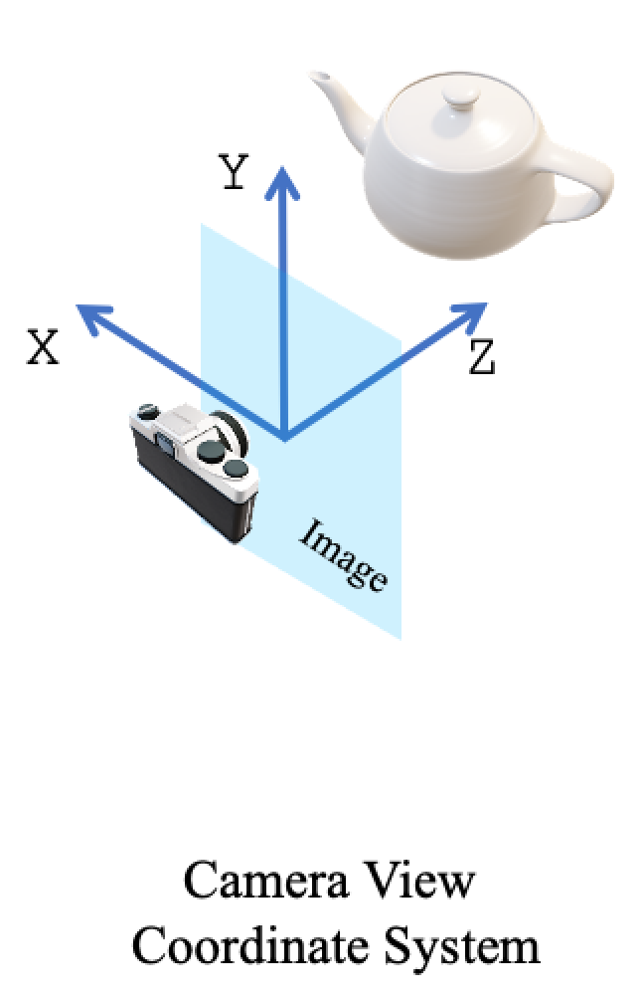

# Hands-on AI based 3D Vision - Homework 1

Group Member 1:
- Name: Long Nguyen
- Matriculation number: 5709676 

Group Member 2: 
- Name: 
- Matriculation number:   

# Theoretical exercises (29 Points)

The file `Assignments-ex1.pdf` contains theoretical exercises for the Hands-on AI-Based 3D Vision course, focusing on fundamental concepts crucial for understanding 3D geometry and camera modeling.

You will work on two main topics:
- 3D Transformations: Explore different types of 3D transformations (rigid, similarity, affine, and projective), understand their properties, and analyze how they affect geometric structures.
- Estimating Camera Pose from 3D-2D Correspondences: Learn how to recover camera parameters from known 3D points and their 2D projections, using a linear estimation approach based on the Direct Linear Transform (DLT) method.

The assignments are designed to deepen your understanding of projective geometry, linear algebra applications in vision, and camera calibration techniques. You are encouraged to complete all theoretical questions.

Submission: Please submit a single PDF document containing your answers to all theoretical questions.

# Programming Exercises (50 Points)

## Getting Started

### Environment Setup

We suggest you to use Visual Studio Code with the python extension (ms-python.python).

**Using Python 3.10 or newer** 

you have two options:

#### 1) Conda
First install conda following the official installation guide: [Conda installation instructions](https://www.anaconda.com/docs/getting-started/miniconda/install).<br>
Once installed, create a virtual environment with conda as follows:
```
conda create -n 3DVision-ex1 python==3.12
conda activate 3DVision-ex1
```

#### 2) Python venv

If you prefer venv, you can run:
```
python3 -m venv venv
source venv/bin/activate
```

### Dependencies installation

Next, install PyTorch using the instructions [here](https://pytorch.org/get-started/locally/). Select pip as the installation method. **If you're on Linux and have a CUDA-capable GPU, select the latest CUDA version.** This will give you a command like this:

```
pip3 install torch torchvision torchaudio --index-url https://download.pytorch.org/whl/cu126
```

Finally, install this homework's other dependencies:

```
pip install -r requirements.txt
```

You can now open the project directory in VS Code. Within VS Code, open the command palette (<key>⌘ command</key>/<key>ctrl</key> + <key>⇧ shift</key> + <key>P</key>), run `Python: Select Interpreter`, and choose the virtual environment you created in the previous steps.

## Project Components

### Part 0: Introduction

This part doesn't involve programming. Just run the script using the provided VS Code launch configuration:

- Navigate to the debugger (<key>⌘ command</key>/<key>ctrl</key> + <key>⇧ shift</key> + <key>D</key>).
- Select `Part 0: Introduction` from the drop-down menu.
- Click the green run button.

<details>
<summary>Running code directly from a command line (not recommended)</summary>
<br>

Remember to activate your virtual environment using `conda activate 3DVision-ex1` or `source venv/bin/activate` first. Then, run the following command:

```
python3 -m scripts.0_introduction
```

</details>

### Part 0.1: Notebook 00 - PyTorch (**Not mandatory**) (8 Bonus Points)

This part conists of filling the python notebook from `notebooks/00_Torch_TensorOps.ipynb`. This notebook is **NOT MANDATORY**.

If you've never used PyTorch before or want to go over the basics again, we recommend giving it a try. If you're already experienced with PyTorch, you might still discover something new.

The notebook introduces concepts related to PyTorch Tensors (creation, gpu tensors, shape manipulation, indexing), Tensor Operations (torch operations and einsum).

You will find exercises to solve. Each exercise has an example of output, so you can check whether your code output is correct.

By the end of this notebook, you will have a solid grasp of the PyTorch library and be well-equipped to work with most publicly available code for state-of-the-art models.

As you can imagine, a deep understanding of these concepts will provide a strong foundation to build upon—one that will be essential for tackling more advanced topics later in the course.

### Part 1: Notebook 01 - Transformations (18 Points)

This notebook contains exercises on 2D and 3D transformations. It is located at `notebooks/01_Transformations.ipynb`, and focuses on understanding and implementing 2D and 3D transformations. These transformations are fundamental for working with geometric data in computer vision and graphics.

#### Topics Covered:
- **Coordinate Systems**: Understanding world, camera, and image coordinate systems.
- **3D Transformations**: Translation, rotation, scaling, and their matrix representations.

#### Exercises:
Each exercise includes detailed instructions on what we expect from you. Make sure to test your implementations thoroughly.

By completing this notebook, you will gain a deeper understanding of transformations, which are essential for tasks such as object detection, 3D reconstruction, and camera calibration.

### Part 2: Point Cloud Projection (16 Points)

In this part, the task of projecting a point on on an image plane will be tackled.

To complete the task, you have to fill out functions of the following:

- `src/proj.py`

We wrote some tests that you can run to check whether you implementations are correct. To run tests, click on the test icon on the left-most panel, and run `3DVision-ex1` tests with the `Run Test` button (triangle shape).

Once all the functions are working, you can lunch the final visualization with `python3 -m src.proj` or by running `Part 1: Projection` from the debugger. It will show the point projection and orthographic projection of a pointcloud on a random camera.

### Part 3: Direct Linear Transform (DLT) algorithm for camera pose estimation (16 Points)

In this part, you will work on the file `notebooks/03_DLT.ipynb`. This notebook focuses on implementing the Direct Linear Transform (DLT) algorithm for camera pose estimation. Please do the corresponding theoretical exercise (ex 2) first, as it will guide you through the steps of the DLT.

---

#### Notes on Camera Formats

##### Camera Coordinate System

We use a bottom-right convention for the camera system. This means that the x axis points to the left, the y axis points to the top, and the z axis points towards the scene.

<center></center>

##### Intrinsics

In this class, camera intrinsics are represented as 3x3 matrices that have been normalized via division by the image height $h$ and image width $w$.

$$
K = \begin{bmatrix}
    \frac{f_x}{w} & 0 & \frac{c_x}{w} \\
    0 & \frac{f_y}{h} & \frac{c_y}{h} \\
    0 & 0 & 1
\end{bmatrix}
$$

#### Running Tests

We've included some tests that you can use as a sanity check. These tests only test basic functionality—it's up to you to ensure that your code can handle more complex use cases (e.g. batch dimensions, corner cases). Run these tests from the project root directory as follows:

```
python -m pytest tests
```

You can also run the tests from inside VS Code's graphical interface. From the command palette (<key>⌘ command</key>/<key>ctrl</key> + <key>⇧ shift</key> + <key>P</key>), run `Testing: Focus on Test Explorer View`.


--------------------------------------

## Submission Policy

We expect a `group_${group_number}.zip` file with all the codebase and the pdf containing the answers to the theoretical part inside.

You can send the .zip file to:
- ta_3dvision@listserv.uni-tuebingen.de

**Deadline: ** 13.05 00:00 PM

## [Optional] Bonus Problem

Each homework will have a bonus problem that we will use to allocate bonus points. **These problems are completely optional.** For this homework, bonus points will be awarded for theoretical exercise 1.a.iv, and for the `notebooks/00_Torch_TensorOps.ipynb` notebook.

