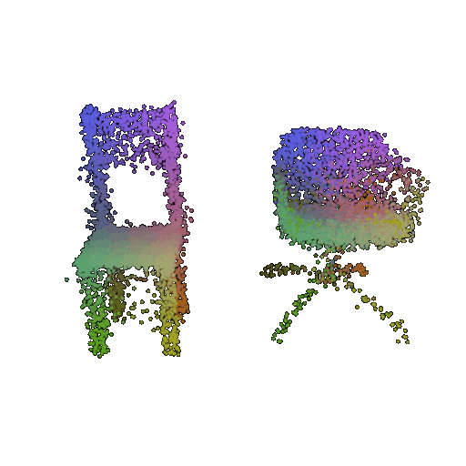

# Hands-on AI based 3D Vision - Homework 3

Group Member 1:
- Name:
- Matriculation number: 

Group Member 2: 
- Name: 
- Matriculation number:   

# 🚀 Programming Exercises (80)

Welcome to the programming exercises for 3D Vision! Get ready to dive into some exciting topics in 3D geometry and reconstruction. Let's get started! 💻✨

---

## ⚙️ Getting Started

### 🛠️ Environment Setup

We recommend using **Visual Studio Code** with the [ms-python.python](https://marketplace.visualstudio.com/items?itemName=ms-python.python) extension

> 💡 Make sure you're using **Python 3.10 or newer**

You have two setup options:

#### 🐍 Option 1: Conda (Recommended)
1. Install Conda following the [official instructions](https://www.anaconda.com/docs/getting-started/miniconda/install).
2. Create and activate a virtual environment:
    ```bash
    conda create -n 3DVision-ex3 python=3.12
    conda activate 3DVision-ex3
    ```

#### 🧪 Option 2: Python venv
If you prefer `venv`:
```bash
python3 -m venv venv
source venv/bin/activate
```
---

## 📦 Installing Dependencies

### 🔧 Step 1: Install Dependencies


For this homework, we strongly suggest you to use `conda` to manage your environment.

"Why?" you may ask. Well, one of the dependencies for this project is `pytorch3d`, which is very delicate when it comes to installing packages (aka it can easily break your environment).

Luckily you have """good""" TAs who can provide you a simple conda command to install it easily:
```bash
conda install pytorch-gpu torchvision torchaudio pytorch3d pytorch-cuda -c pytorch -c nvidia -c conda-forge -c pytorch3d
```

If you instead want to use python venv, [here](https://github.com/facebookresearch/pytorch3d/blob/main/INSTALL.md) is the link to their installation guide. Good luck! 

p.s. Don't forget to install torch and torchvision too.

> ⚠️ Make sure to install the version matching your hardware setup!

### 📥 Step 2: Install Project Requirements

Once PyTorch is installed, install the remaining dependencies listed in the requirements.txt file:

```bash
pip install -r requirements.txt
```
This includes packages used throughout the notebooks (e.g., NumPy, Matplotlib, Trimesh, etc.).


### 🧭 Configure VS Code

1) Open the project folder in VS Code.
2) Open the Command Palette:
    - macOS: ⌘ + ⇧ + P
    - Windows/Linux: Ctrl + ⇧ + P
3) Search for Python: Select Interpreter
4) Choose the virtual environment you created earlier (3DVision-ex3 or venv)

> 🧠 This step ensures that VS Code uses the correct Python interpreter and sees all installed dependencies.

## 🧩 Project Components

The programming assignment is divided into four parts, each designed to build your understanding of surface reconstruction and 3D geometry — from foundational techniques to deep learning pipelines. Let’s walk through them:

---

### 🟩 Part 01: Marching Squares & Marching Cubes (20 Points)

In this first part, you'll explore **isosurface extraction** — one of the fundamental concepts in 3D reconstruction.

#### 📌 Goals:
- Understand how to extract **contours** and **surfaces** from scalar fields.
- Implement two classic algorithms: **Marching Squares (2D)** and **Marching Cubes (3D)**.

#### 🧠 Concepts:
- Signed distance fields
- Zero-level set
- Surface mesh generation

#### 📁 Files:
- `notebooks/marching_squares_exercise.ipynb`**(8 Points)**:  
  Work on a 2D grid and implement **Marching Squares** to extract contour lines.
  
- `notebooks/marching_cubes_exercise.ipynb`**(12 Points)**:  
  Move to 3D and implement **Marching Cubes** to generate triangle meshes of surfaces embedded in volumetric data.

> 💡 Tip: Visualize your outputs! Surface extraction is much more intuitive when you see it.

---

### 🟦 Part 02: Poisson Surface Reconstruction (20 Points)

Here you’ll tackle a more advanced reconstruction method: **Poisson Reconstruction**, often used in 3D scanning pipelines.

#### 📌 Goals:
- Learn how to recover a **watertight surface** from an oriented point cloud.
- Implement the algorithm and observe how it performs with noisy data.

#### 🧠 Concepts:
- Vector fields and indicator functions
- Solving Poisson equations on spatial grids
- Mesh reconstruction from gradients

#### 📁 File:
- `notebooks/poisson_reconstruction_exercise.ipynb`

> 🧪 Want a challenge? Try using your own point cloud or experiment with different octree depths!

---

### 🟨 Part 03: Procrustes Alignment (16 Points)

In this part, you will implement the **Procrustes algorithm**, a tool used for aligning 3D shapes.

#### 📌 Goals:
- Implement rigid alignment between two point clouds.
- Minimize reconstruction error using SVD-based optimization.

#### 🧠 Concepts:
- Centering and normalization
- Optimal rotation via Singular Value Decomposition (SVD)
- Shape alignment in statistical shape modeling

#### 📁 File:
- `notebooks/procrustes_alignment_exercise.ipynb`

> 📐 This technique is essential in shape analysis, 3D morphable models, and registration pipelines.

---

### 🟥 Part 04: MVSNet — Multi-View Stereo with Deep Learning (20 Points)

Now it’s time to step into **deep learning for geometry**. You’ll work with **MVSNet**, a deep network for dense multi-view stereo.

#### 📌 Goals:
- Learn to run real-world 3D reconstruction pipelines.
- Understand how learned depth maps can be fused into 3D point clouds and meshes.
- Practice working with external codebases — a crucial research skill.

#### 🧠 Concepts:
- Multi-view stereo and plane sweeping
- Learned cost volume aggregation
- Depth map fusion and `.ply` mesh outputs

#### 🛠️ What to do:
1. Clone the MVSNet repo from [xy-guo/MVSNet_pytorch](https://github.com/xy-guo/MVSNet_pytorch)
2. Follow the README instructions to:
   - Download the **DTU dataset** and pretrained weights
   - Run evaluation on the **test set** (⚠️ not training set)
3. Collect and include **2 randomly selected `.ply` files** in your submission.

> ⚡ **Hint:** We recommend running this on the university **GPU Cluster** — local machines may struggle with compute requirements.

> Note: The base environment for this homework should work with MVSNet flawlessly.
---


### 🌟 Bonus Points Opportunity: Your Own MVSNet Demo! (10 Bonus Points)

Earn bonus credit by taking MVSNet beyond the DTU dataset. Here's how:

#### 🎯 Task:
- Record a short video (e.g. of a building in **Tübingen**)
- Use **COLMAP** to extract:
  - Camera poses
  - Sparse point cloud
- Convert the data into the format required by MVSNet
- Run the pipeline and share your own reconstructions!

> 🎬 Real-world data is messy — learning how to deal with it is invaluable. We’re excited to see what you can capture and reconstruct!

---

### 🟨 Part 05: PointNet (24 Points)
In this exercise you will implement PointNet for classification, segmentation and correspondence search.
Please refer to the official [paper](https://arxiv.org/pdf/1612.00593).
In the first two parts of the exercise you will implement the PointNet architectures for classification and segmentation respectively.

In the third part, you will implement an encoder-decoder network that can be used to find dense corresponendences on between point clouds of the same category. The idea is to use PointNetEncoder which maps an unordered point cloud $X \in \mathbb{R}^{N \times 3}$ to some global shape vector $z \in \mathbb{R}^{1024}$. A simple MLP then maps this vector $z$ back to an **ordered** point cloud $X' \in \mathbb{R}^{N \times 3}$. The PointNet encoder and MLP are trained jointly with the objective of minimizing the chamfer distance between the input $X$ and the reconstructed point cloud $X'$. 
It turns out that the implicit order of the output of the MLP can be used to find correspondences between objects. This is visualized below, where you can see two different types of chairs that were passed through this autoencoder. The colors of the points correspond to their position in the ordering of the output. You can see that the two point clouds follow the same coloring scheme (same colors for same legs etc).




##### Data & GPU
We recommend running this exercise on the TCML cluster. Train and Test datasets have already been uploaded on the cluster for all tasks. They are located in `/common/share/3DVision-ex3-data`. If you want to run this exercise locally (you need a gpu), you can copy the data from the cluster and adjust the arguments `--main_data` etc.
If you want to run this exercise locally, you can also reduce the number of points by passing the `--num_points` argument, as well as the batch size via `--batch_size`. This will speed up training and inference.
 
##### Implementation Tasks: (9 Points)
1. Implement the class `TNet` in `models.py` which takes as input a point cloud and produces a transformation matrix $T \in \mathbb{R}^{d \times d}$ (see PointNet paper, appendix).
2. Implement the class `PointNetEncoder` in `models.py` which takes a point cloud as input and computes the global feature vector. Make sure you have the boolean argument `vanilla` which specifies whether the model should be vanilla (i.e. without TNets) or not.
3. Implement the two task-specific models `cls_model`for classification, and `seg_model` for segmentation task in `models.py`. Also complete the `train.py` and `eval_seg.py` with inference code and loss functions.
4. Implement the model `cor_model` in `models.py` which uses a PointNetEncoder followed by an MLP with hidden dimensions (1024, 2048). The output of the model should be of shape (num_points, 3). Also implement the forward pass and the loss function in `train_cor.py` and `eval_cor.py`. You may use `pytorch3d.loss.chamfer_distance` for the loss function.

##### Experiments
###### Classification (5 Points)
Train a vanilla model for the classification task on the training data provided. Feel free to play around with the training parameters. The training command is
```
python main.py --task "cls" --vanilla
```
Report the accuracy of the model evaluated on the test set. Evaluation can be done with the command.
```
python main.py --task "cls" --vanilla --load_checkpoint <checkpoint_name> 
```
Report the accuracy of your model when rotating the test objects around the y-axis (up-axis) by some random angles and some Gaussian noise added per point. This can be done by adding `--randomization` to the evaluation command.


Train a second non-vanilla model with `--randomization` activated during training via
```
python main.py --task "cls" --randomization
```
Again report the accuracy on the test set with and without randomization.


###### Segmentation (5 Points)
Train a model for the segmentation task on the training data provided in `data/seg`. The training command is
```
python main.py --task "seg" --randomization
```
Report the accuracy of the model evaluated on the test set.
```
python main.py --task "seg" --randomization --load_checkpoint <checkpoint_name> --eval
```
Visualize the part segmentation for 5 different objects using
```
python eval_seg.py --i <object_id> --load_checkpoint <checkpoint_name>
```
Visualizations will be written to the subdirectory `output`.

###### Correspondences (5 Points)
Train a model that finds dense correspondences between two chairs via
```
python train_cor.py
```
Show the results for different epochs (i.e. show the correspondences obtained from your epoch 0 checkpoint vs those at the end of the training) and object pairs.
```
python eval_cor.py --load_checkpoint <checkpoint_name> --i <obj1_id> --j <obj2_id>
```

---

## Submission Policy

We expect a `group_${group_number}.zip` file with all the codebase and the pdf containing the answers to the theoretical part inside.

You can send the .zip file to:
- ta_3dvision@listserv.uni-tuebingen.de

**Deadline: ** 17.06 12:00 AM

## [Optional] Bonus Problem

**Bonus problems are completely optional (as always).** For this homework, bonus points will be awarded for running MVSNet on YOUR data.