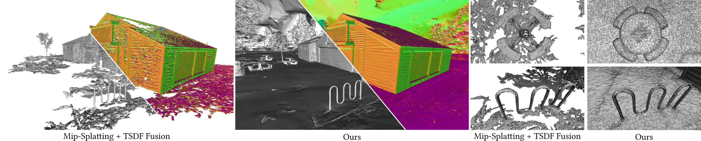

<p align="center">

  <h1 align="center">Gaussian Opacity Fields: Efficient Adaptive Surface Reconstruction in Unbounded Scenes</h1>
  <p align="center">
    <a href="https://niujinshuchong.github.io/">Zehao Yu</a>
    ·
    <a href="https://tsattler.github.io/">Torsten Sattler</a>
    ·
    <a href="http://www.cvlibs.net/">Andreas Geiger</a>

  </p>

  <h2 align="center">SIGGRAPH ASIA 2024 (Journal Track)</h2>

  <h3 align="center"><a href="https://drive.google.com/file/d/1_IEpaSqDP4DzQ3TbhKyjhXo6SKscpaeq/view?usp=share_link">Paper</a> | <a href="https://arxiv.org/pdf/2404.10772.pdf">arXiv</a> | <a href="https://niujinshuchong.github.io/gaussian-opacity-fields/">Project Page</a>  </h3>
  <div align="center"></div>
</p>

> **_Fork for clusters or cases where a system-wide CUDA Toolkit installation is not possible_**

> This repo and 3DGS original repo assume that the user has access to a a system-wide CUDA Toolkit installation. This is not possible, for instance, in clusters. Thus we have changed the installation instructions to reflect this.

> Since this repo uses CUDA 11.3 for pytorch and compiling the custom operators gcc may need to be downgraded too and some environment variables set to find the correct linkers and for Cmake to work

<p align="center">
  <a href="">
    
  </a>
</p>

<p align="center">
Gaussian Opacity Fields (GOF) enables geometry extraction with 3D Gaussians directly by indentifying its level set. Our regularization improves surface reconstruction and we utilize Marching Tetrahedra for adaptive and compact mesh extraction.</p>
<br>

# Updates

* **[2024.09.11]**: GOF is accepted to SIGGRAPH ASIA 2024 Journal Track. We updated paper with more details, explanations, and ablations.

* **[2024.06.10]**: 🔥 Improve the training speed by 2x with [merged operations](https://github.com/autonomousvision/gaussian-opacity-fields/pull/58). 6 scenes in TNT dataset can be trained in ~24 mins and the bicycle scene in the Mip-NeRF 360 dataset can be trained in ~45 mins. Please pull the latest code and reinstall with `pip install submodules/diff-gaussian-rasterization` to use it.

# Installation
Create an anaconda environment using with compatible gcc compiler as follows:
```
conda create -y -n gof python=3.8
conda activate gof
conda install 'gxx[version=">=5,<10.2.1"]' -c conda-forge -y
conda install --channel=conda-forge libxcrypt -y

pip install torch==1.12.1+cu113 torchvision==0.13.1+cu113 -f https://download.pytorch.org/whl/torch_stable.html
conda install cudatoolkit-dev=11.3 -c conda-forge -y

pip install -r requirements.txt

# --- Pip Installs with Linker Flag ---
# You may need to set LDFLAGS if there are linker issues
export LDFLAGS="-L/usr/lib/x86_64-linux-gnu"
pip install submodules/diff-gaussian-rasterization
pip install submodules/simple-knn/
unset LDFLAGS # Unset immediately after use

# --- CMake Build ---
cd submodules/tetra-triangulation
conda install cmake -y
conda install conda-forge::gmp -y
conda install conda-forge::cgal -y

export CC=$CONDA_PREFIX/bin/gcc
export CXX=$CONDA_PREFIX/bin/g++
export CPATH=$CONDA_PREFIX/include:$CPATH

# If cmake fails for whatever reason one should rm before trying again:
# rm -rf CMakeCache.txt CMakeFiles/
cmake .
make
pip install -e .
```

# Dataset

Please download the Mip-NeRF 360 dataset from the [official webiste](https://jonbarron.info/mipnerf360/), the NeRF-Synthetic dataset from the [NeRF's official Google Drive](https://drive.google.com/drive/folders/128yBriW1IG_3NJ5Rp7APSTZsJqdJdfc1), the preprocessed DTU dataset from [2DGS](https://surfsplatting.github.io/), the proprocessed Tanks and Temples dataset from [here](https://huggingface.co/datasets/ZehaoYu/gaussian-opacity-fields/tree/main). You need to download the ground truth point clouds from the [DTU dataset](https://roboimagedata.compute.dtu.dk/?page_id=36) and save to `dtu_eval/Offical_DTU_Dataset` to evaluate the geometry reconstruction. For the [Tanks and Temples](https://www.tanksandtemples.org/download/) dataset, you need to download the ground truth point clouds, alignments and cropfiles and save to `eval_tnt/TrainingSet`, such as `eval_tnt/TrainingSet/Caterpillar/Caterpillar.ply`.


# Training and Evaluation
```
# you might need to update the data path in the script accordingly

# NeRF-synthetic dataset
python scripts/run_nerf_synthetic.py

# Mip-NeRF 360 dataset
python scripts/run_mipnerf360.py

# Tanks and Temples dataset
python scripts/run_tnt.py

# DTU dataset
python scripts/run_dtu.py
```

# Custom Dataset
We use the same data format from 3DGS, please follow [here](https://github.com/graphdeco-inria/gaussian-splatting?tab=readme-ov-file#processing-your-own-scenes) to prepare the your dataset. Then you can train your model and extract a mesh (we use the Tanks and Temples dataset for example)
```
# training
# -r 2 for using downsampled images with factor 2
# --use_decoupled_appearance to enable decoupled appearance modeling if your images has changing lighting conditions
python train.py -s TNT_GOF/TrainingSet/Caterpillar -m exp_TNT/Caterpillar -r 2 --use_decoupled_appearance

# extract the mesh after training
python extract_mesh.py -m exp_TNT/Caterpillar --iteration 30000

# you can open extracted mesh with meshlab or using the following script based on open3d
python mesh_viewer.py exp_TNT/Caterpillar/test/ours_30000/fusion/mesh_binary_search_7.ply
```

# Acknowledgements
This project is built upon [3DGS](https://github.com/graphdeco-inria/gaussian-splatting) and [Mip-Splatting](https://github.com/autonomousvision/mip-splatting). Regularizations and some visualizations are taken from [2DGS](https://surfsplatting.github.io/). Tetrahedra triangulation is taken from [Tetra-NeRF](https://github.com/jkulhanek/tetra-nerf). Marching Tetrahdedra is adapted from [Kaolin](https://github.com/NVIDIAGameWorks/kaolin/blob/master/kaolin/ops/conversions/tetmesh.py) Library. Evaluation scripts for DTU and Tanks and Temples dataset are taken from [DTUeval-python](https://github.com/jzhangbs/DTUeval-python) and [TanksAndTemples](https://github.com/isl-org/TanksAndTemples/tree/master/python_toolbox/evaluation) respectively. We thank all the authors for their great work and repos. 

# Citation
If you find our code or paper useful, please cite
```bibtex
@article{Yu2024GOF,
  author    = {Yu, Zehao and Sattler, Torsten and Geiger, Andreas},
  title     = {Gaussian Opacity Fields: Efficient Adaptive Surface Reconstruction in Unbounded Scenes},
  journal   = {ACM Transactions on Graphics},
  year      = {2024},
}
```
If you find the regularizations useful, please kindly cite
```bibtex
@inproceedings{Huang2DGS2024,
    title={2D Gaussian Splatting for Geometrically Accurate Radiance Fields},
    author={Huang, Binbin and Yu, Zehao and Chen, Anpei and Geiger, Andreas and Gao, Shenghua},
    publisher = {Association for Computing Machinery},
    booktitle = {SIGGRAPH 2024 Conference Papers},
    year      = {2024},
    doi       = {10.1145/3641519.3657428}
}
```
